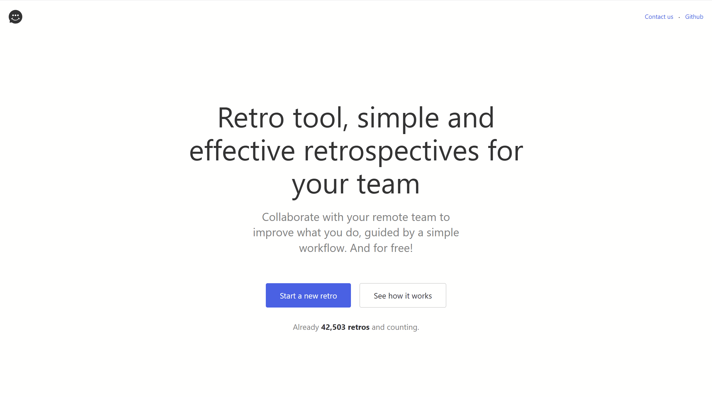

# Quality Engineering Playwright Pairing Exercise

The QE pairing tool uses an [online retrospective tool](https://www.retrotool.app/) to create, interact, complete and assert against the final "export" of data. The tool can be seen in use below or feel free to explore the tool now.



## Introduction

This pairing exercise will consist of 2 testing approaches around the same scenario. The code has **not** been written with best practice in mind, however you cna assume a junior engineer was given the following spec:

>If we use the retrospective tool and add some positive feedback and an actionable item does the final "exported" information contain all the necessary information for our technical lead to take away and see that they are actioned*

>We have developed an external tool to send feedback from people who are unable to attend the meeting, we can assume that this application works perfectly but we need to check that if we create a retrospective and run the tool the feedback appears in the final export in the same way if added using the UI. TLDR: if feedback is added via the API does it appear in the UI

Given the above 2 scenarios we have the following scenarios:

1. [RetrospectiveTests](./test/RetroFeedbackTests/1_RetrospectiveTests.cs) - test that interacts with the UI to add items and move through stages of the retrospective before asserting the final result.
1. [EnhancedRetrospectiveTests](./test/RetroFeedbackTests/2_EnhancedRetrospectiveTests.cs) - test that follows the same UI approach as the previous step except the feedback is added via API calls rather than typing into the textbox.

## Instructions

Both tests are broken, how you approach investigating why they are broken and potential avenues into fixing them is entirely at your discretion. We encourage you to ask as many questions as you need and this is not a pass/fail exercise it is a chance for us to see you approach a new codebase and diagnose failing tests. The assumption is that you will be familiar with Playwright and C# and will be able to talk through the steps you are taking to diagnose, critique and resolve any issues you see fit. 


## Getting Started

Move into the `RetroFeedbackTests` directory with the following command, build the project and run the playwright install script.

```ps1
cd test\RetroFeedbackTests
dotnet build
pwsh .\bin\Debug\net9.0\playwright.ps1 install  
```

Once the playwright tools have been installed you can run the `dotnet test` command at the project root to run the tests

# FAQ

Windows based Execution Policy
>playwright.ps1 is
not digitally signed. You cannot run this script on the current system. For more information about running scripts and
setting execution policy, see about_Execution_Policies at https:/go.microsoft.com/fwlink/?LinkID=135170.
At line:1 char:1

You can see your policies by running `Get-ExecutionPolicy -List` and change the rules for the current process by running `Set-ExecutionPolicy -Scope Process Bypass` then run the script again.